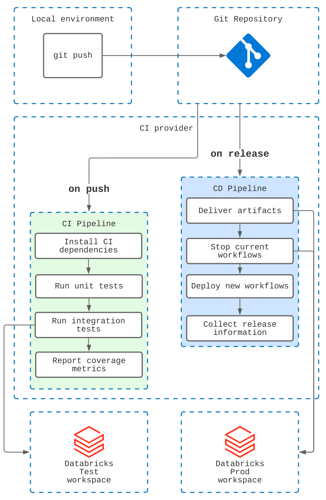

# :material-axis-arrow: DevOps for Workflows

## :material-text-search: Glossary

Let's quickly introduce the basic glossary and principles.

### **:octicons-package-dependents-24: Task**

By **:octicons-package-dependents-24: task**, we mean a unit element of a workflow. In particular, a task
could be:

- ETL task which takes one or multiple tables as input, and produces one or multiple tables as output
- ML task which prepares a new version of a machine learning model

A task might have upstream and downstream dependencies. In practice, the task could be a one-step inside multitask
workflow, or a single-step workflow.

**:octicons-package-dependents-24: Tasks** are usually combined into **:octicons-workflow-24: workflows**.

### **:octicons-workflow-24: Workflow**

By **:octicons-workflow-24: workflow**, we mean the composition of tasks. Workflows are expected to
have the following properties:

- The workflow consists of one or more tasks
- The workflow might be triggered in different ways, but they have a defined trigger (reason to start)

**:octicons-workflow-24: Workflows** can be classified by the following properties:

- Batch or streaming
- Regularly scheduled or triggered by an external event
- It has a defined set of inputs (tables, files, other data sources)
- and a defined set of outputs (in a perfect setup it shall be Delta tables, but also could be other outputs such as
  databases/event queues etc.)

### :octicons-repo-forked-24: Continuous Integration and :fontawesome-solid-ship: Continuous Delivery

From the perspective of the code packaging and delivery, there are two separate processes
that bring **:octicons-workflow-24: Workflows** to environments:

**:octicons-repo-forked-24: CI** - alias for Continuous Integration.

In short, CI is a process,
responsible for the correct handling of code changes in a particular
project. CI might include components such as unit and integration
tests. Important to drop a separation line - CI is not responsible
for deploying the artifacts to a specific environment. It is
responsible for verifying that code changes are properly managed and
tested inside the development environment.

**:fontawesome-solid-ship: CD** - alias for Continuous Delivery.

While the CI process
verifies that code changes themselves are managed well inside the
development environment, the CD is responsible for propagating the
code changes towards production environments and properly providing
the releases.

Finally, By **DevOps**, we mean the automated process of accepting the code changes and
rolling out releases towards different environments.

Now, we can combine a definition of **DevOps for :octicons-workflow-24: workflows**:

!!! summary

    **DevOps for :octicons-workflow-24: workflows** is process that ensures that code changes of a partcular
    **:octicons-workflow-24: workflow** is managed and tested in the most possible automated way.
    In particular, when a change is applied towards the code of the workflow, this
    change shall be tested inside a **:octicons-repo-forked-24: CI** process first.
    Final rollout of the code to the production is a fully automated and controlled process.

## :octicons-milestone-24: Components of a DevOps

To make minimal **DevOps for :octicons-workflow-24: workflows**, 3 main requirements shall be fulfilled:

- Code of the workflows shall be stored in a :material-git: Git-like repository. In practice, it means
  using git providers such as GitHub, GitLab, Azure Repos, Bitbucket,
  etc.
- Each important code change shall trigger a CI or a CD pipeline.
- CI/CD pipelines describe the set of
  steps required to perform CI/CD operations. There are
  various CI/CD providers, such as Jenkins, GitHub Actions, GitLab
  CI, Azure DevOps, Bitbucket Pipelines, Circle CI, Drone CI, etc.

Whichever git provider and CI/CD provider you choose, most probably you
will end up organizing the following:

- CI/CD pipelines will be defined in a YAML-like format. The CI/CD
  pipelines will describe a set of steps that shall be performed on
  each trigger.

- A generic set of steps inside a **:octicons-repo-forked-24: CI** pipeline
    - Install project dependencies in a CI environment
    - Verify the code conventions with linters
    - Run unit tests
    - Run integration tests
    - Collect code coverage metrics

- A generic set of steps inside a **:fontawesome-solid-ship: CD** pipeline:
    - Ship the artifact to the production environment
    - Stop currently running workflows
    - Release the new version
    - Start the workflows again

To understand which pipeline needs to be executed in which case,
most of the CI/CD providers support triggers functionality.

A **:material-arrow-decision-auto-outline: trigger** is an event that could happen with the repository, for example:

- on push into a branch with name `feature/*`
- on each merge towards the `main` branch
- on each new tag, for example when a tag `v1.0.0` has been pushed

A combination of these events allows configuring a set of proper
CI/CD pipelines to make the overall process controllable. In most
cases, such CI/CD pipelines are defined inside the same repository
where data pipelines, mostly for the simplicity of management and
project modularity.

## :material-axis-arrow: Generic DevOps for Workflows blueprint

Combining all of the above, a generic **DevOps for :octicons-workflow-24: workflows** blueprint looks like this:

 DevOps for Workflows blueprint (click to 🔎 Zoom)

## `dbx` in the DevOps for workflows

`dbx` supports DevOps for workflows in they way of providing elaborate interface to define configurations and perform
deployments.

For these purposes you'll need to configure the [:material-file-code: deployment file](../reference/deployment.md) and use `dbx deploy`
command.

