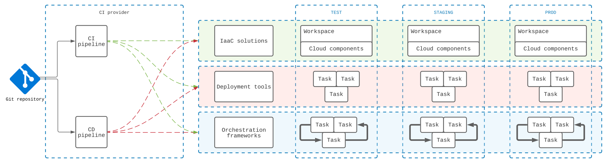

# :fontawesome-solid-map-location-dot: Place of `dbx` in the ecosystem

This section describes the concepts, high-level architectural considerations and use-cases for `dbx`.

## :material-bridge: High-level architecture and frameworks

First of all, `dbx` is an automation tool. In this section we uncover the various layers of automation, as well as the
place of `dbx` in this ecosystem.

From the automation perspective, the tools to work with the Databricks Lakehouse Platform can be divided into the
following layers:

- **:material-cloud-tags: Infrastructure**  - how the Databricks workspaces and relevant cloud components are deployed
- **:octicons-workflow-24: Workflows** - In a wide sense, it's how the data should be processed on the platform. At this
  layer the tasks and workflows are defined and operated.
- **:material-arrow-decision: Orchestration** - at this layer the relations and schedules of the workflows are defined.

The relation between these layers and environments can be represented as follows:

 Automation layers (click to 🔎 Zoom)

### :material-cloud-tags: Infrastructure

Infrastructure layer is usually covered by **IaaC solutions**.
For Databricks, one of the most suitable IaaC solutions
is :material-terraform: [Terraform](https://www.terraform.io/),
together with
the [Databricks Terraform provider](https://registry.terraform.io/providers/databricks/databricks/latest/docs).

On this layer usually the DevOps team configures the workspace allocation,
dependencies on the cloud resources, as well as in-Databricks components (e.g. clusters, instance pools, permissions).

### :octicons-workflow-24: Workflows

Writing and managing workflows and tasks on the Databricks platform could be done in many various ways.

One approach is to use [`databricks-cli`](https://github.com/databricks/databricks-cli) for low-level automation,
and add some glue code (usually in :octicons-command-palette-24: Bash or in :material-language-python: Python) for file uploads and
job update functionality.
Another approach is to use the above-mentioned :material-terraform: Terraform provider and manage jobs with it as well.

Although we consider both of the approaches above solid enough,
we also assume that potential users might seek for a middle option which doesn't require users to write wrappers (on one
side),
and also doesn't require knowledge of the HCL language and details of Terraform (on the other side).

### :material-arrow-decision: Orchestration

Orchestration layer is responsible for the process of scheduling and launching workflows and chains of workflows.

In Databricks, there are many various ways to orchestrate tasks and jobs.
The easiest built-in option is to use the Databricks Workflows functionality as described in
the [official docs](https://docs.databricks.com/workflows/index.html).

On the other side, Since Databricks provides flexible and concise API, this task could be performed from any existing
orchestration solution (e.g. Airflow, Prefect, Flyte).

## :material-cloud-question: Where is `dbx` in this architecture?

`dbx` here provides a solution for the very specific task - development and deployment of the Databricks workflows.

One can consider `dbx` as a solution in between the `databricks-cli` and Terraform, with laser focus on the topic of
workflows development and deployment.

It's core idea is simple - high level, easy-to-use CLI interface to manage **workflows**, **tasks** and their code
without a need to know an advanced configuration language.

`dbx` achieves this by the following:

- It's still a :material-console: CLI interface, easily usable from any CI provider
- No need for file uploads to the cloud storage - `dbx` takes care of the versioned uploading
- No need to update job definitions via cumbersome Bash or Python scripts - `dbx` will do that
- No need to know new configuration language - `dbx` allows users to use YAML or JSON-based definitions, that could be
  :material-car-turbocharger: supercharged with Jinja2 blocks and functions where needed.

## :fontawesome-solid-laptop: Interactive development in the IDE

Amongst with the need to package, deploy and operate workflows, there is also the need for interactive development
experience.

Although Databricks Notebooks already provide a lot of various features that are extremely convenient for rapid
development, there are also Engineers who are unfamiliar with Notebooks, or don't use them because they prefer IDE-based
approach.

With `dbx` this group of users can continue working in the IDE without being forced to use notebooks, and be able to
combine fast development loops and standard linting and testing utils.

The need for proper IDE-based development experience is another reason why `dbx` is useful.
