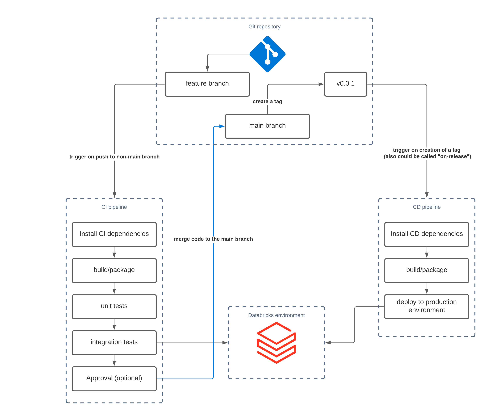

Just enough theory for data pipelines CI/CD automation
======================================================

.. contents::
   :depth: 1
   :local:

What’s this about?
------------------

Let’s quickly introduce the basic glossary:

* By task, we mean a unit element of a pipeline. In particular, a task could be:

    * ETL job which takes one or multiple tables as input, and produces one or multiple tables as output
    * A task might have upstream and downstream dependencies
    * In practice, the task could be a one-step inside multitask job, or a single-step job

* Tasks are to be combined into pipelines
* By data pipeline, we mean the composition of tasks. Pipelines shall have the following properties:

    * The pipeline consists of one or more tasks
    * The pipeline might be triggered in different ways. In particular, pipelines can be classified by the following properties:

        * Batch or streaming
        * Regularly scheduled or triggered by an external event
        * It has a defined set of inputs (tables, files, other data sources) and a defined set of outputs (in a perfect setup it shall be Delta tables, but also could be other outputs such as databases/event queues etc.)

* CI - alias for Continuous Integration. In short, CI is a process, responsible for the correct handling of code changes in a particular project. CI might include components such as unit and integration tests. Important to drop a separation line - CI is not responsible for deploying the artifacts to a specific environment. It is responsible for verifying that code changes are properly managed and tested inside the development environment.
* CD - alias for Continuous Delivery. In short, while the CI process verifies that code changes themselves are managed well inside the development environment, the CD is responsible for propagating the code changes towards production environments and properly providing the releases.

By automation, we mean the process of accepting the code changes and rolling out releases towards different environments shall be automated as much as possible.
In a perfect setup, there shall be no way for manual changes of the code in the production environment.

Now, we can combine a definition of “data pipelines CI & CD automation”:

.. note::

    The process of changing the code of particular data pipelines shall be managed and tested in the most possible automated way. In particular, when a change is applied towards the code of the data pipeline, this change shall be tested on a development environment and approved first.

Generic CI/CD setup
-------------------

To make CI/CD possible, 3 main requirements shall be fulfilled:

* Code shall be stored in a git-like repository. In practice, it means using git providers such as GitHub, GitLab, Azure Repos, Bitbucket, etc.
* Each important code change shall trigger a CI or a CD pipeline.
* In contrast to data pipelines, CI/CD pipelines describe the set of steps required to perform CI/CD operations (while data pipelines describe the ETL or ML operations on top of the data). There are multiple CI/CD providers, such as Jenkins, GitHub Actions, GitLab CI, Azure DevOps, Bitbucket Pipelines, Circle CI, Drone CI, etc.

Whichever git provider and CI/CD provider you choose, most probably you will end up organizing the following:

* CI/CD pipelines will be defined in a YAML-like format. The CI/CD pipelines will describe a set of steps that shall be performed on each trigger.
* A generic set of steps inside a CI pipeline for a Python project can look like this:

    * Install Python in a CI environment
    * Install project dependencies in a CI environment
    * Verify the code conventions with linters
    * Run unit tests
    * Run integration tests
    * Collect code coverage metrics

* A generic set of steps inside a CD pipeline can look like this:

    * Get the artifact (for example, Python package) from the artifact repository
    * Stop currently running data pipelines
    * Release the new version for currently running data pipelines
    * Collect release information
    * To understand which deployment pipeline needs to be executed in which case, most of the CI/CD providers support triggers functionality. A trigger is an event that could happen with the repository, for example:

        * on push into a branch with name :code:`feature/*`
        * on each merge towards the :code:`main` (might be also called :code:`master`) branch
        * on each new tag, for example when a tag :code:`v1.0.0` has been pushed

* A combination of these events allows configuring a set of proper CI/CD pipelines to make the overall process controllable. In most cases, such CI/CD pipelines are defined inside the same repository where data pipelines, mostly for the simplicity of management and project modularity.

Basic CI/CD architecture
------------------------

Combining all of the above, here is a generic CI/CD architecture that can be applied for some projects:

